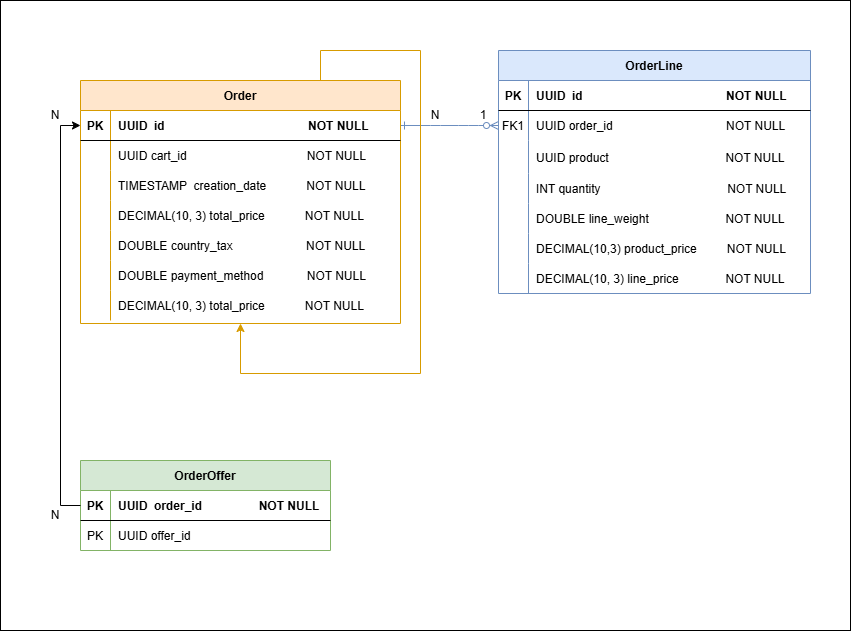

# WRK2025-ORDERS API Endpoints

This service provides RESTful endpoints for managing orders.  
It follows a layered software architecture that separates concerns across presentation, business and presentation.

## Base URL http://localhost:8080/v3/api-docs

---

## · Orders

| Method | Endpoint              | Description                 |
|--------|-----------------------|-----------------------------|
| POST   | `/orders`             | Register a new order        |
| GET    | `/orders`             | Get all orders              |
| GET    | `/orders/{id}`        | Get orders by ID            |
| POST   | `/orders/{id}/return` | Get orders by ID to handle returns |

---

## Database diagram

---

## Simple Diagram explanation

---

## · Event-Driven Features

- Publishes domain events via RabbitMQ.
- Consumes events alert administrators when a product’s stock falls below a specified threshold.

---
## · Swagger UI

After starting the app, browse:
http://localhost:8080/swagger-ui.html
to explore and test the API.

---